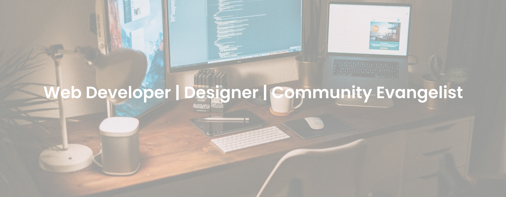

<!-- New readme -->
<head><link rel="stylesheet" href="https://cdnjs.cloudflare.com/ajax/libs/font-awesome/4.7.0/css/font-awesome.min.css"></head>

<h1 align="center">Hi 👋, I'm Devika</h1>

<a href="https://www.linkedin.com/in/devika-varshney-2776721b5/">Linkedin</a> | <a href="https://twitter.com/devika0003_">Twitter</a>

<!---->

I am an aspiring Web developer from Vellore institute of technology, Vellore currently pursuing the second year of Information Technology. I have experience working with Java, Web development, Figma Ui designing.

I am a people person and love being part of communities. <strong>Currently part of Apple developer group of my college and Catsintech community. </strong>If you like to collaborate on projects, discuss some ideas or products, or want to know more about student programs and internships just reach out to me via <a href="https://www.linkedin.com/in/devika-varshney-2776721b5/">Linkedin</a>. I would be happy to help.

🕸️ I'm interested in Web development.

❓ Ask me about Java, Web development, Designing

📖 I'm currently learning ReactJS

🤝 I'm looking to collaborate on Real World Problem Solving Projects

🔥 Currently contributing in SWOC'21

<h2 align="center">Connect Me !! 🤝</h2> 

<a href="mailto:devikavarshney0003@gmail.com">

 

----

<h3 align="left">Languages and Tools:</h3>

 </a> <a href="https://dart.dev" target="_blank">
  
  
    
 

  
GitHub Trophies 🏆

    
  

 

  <a href="https://github.com/devikavarshney">
    
    
    
  </a>

  
<strong>📈 My Github Stats</strong>

   
  
  

    
  

   
  

    
  

  

 

---

    
 

---

---
